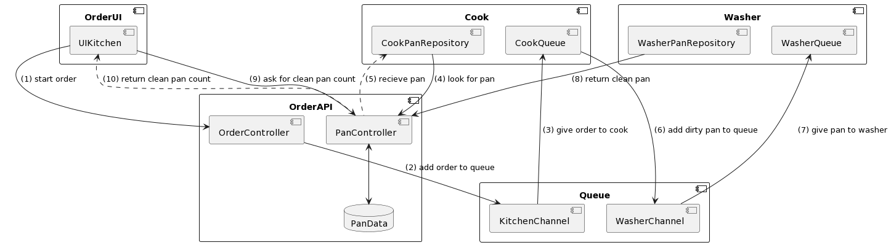

# Distributed Systems Demo Project
An example for a Distributed Systems project. It contains 
- OrderUI: a JavaFX frontend
- OrderAPI: a REST-Service implemented with Sprint Boot
- two worker services: CookService and WasherService
- and a messaging queue (RabbitMQ) prepared in an docker-compose.yml file

## Scenario


## Docker-Services
- Queue
    - URL: localhost:5672
    - Web: localhost:15672

## Requirements
- [Docker](https://docs.docker.com/get-docker/)

## Start
```shell
docker-compose up
```

## Documentations
- [RabbitMQ](https://www.rabbitmq.com/tutorials/tutorial-one-java.html)
